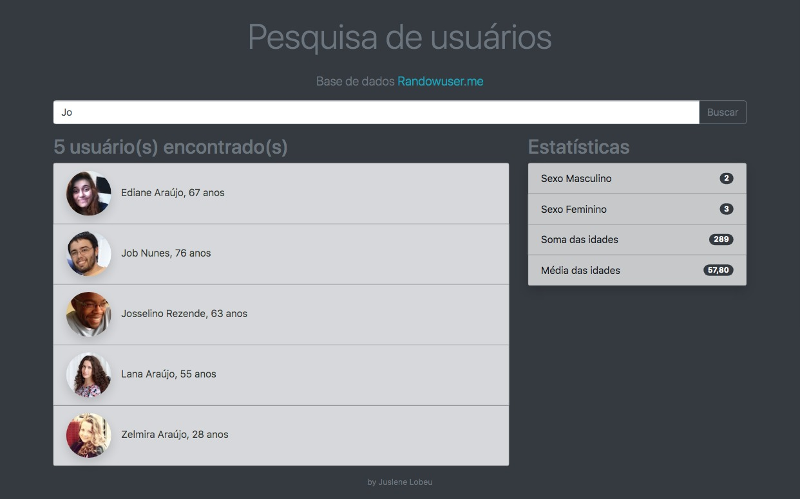

# Busca de usuário - API [Randowuser.me](https://randomuser.me/)
Desafio do Bootcamp "Desenvolvedor Full Stack" da IGTI

## Preview

### Link
[Github pages](https://juslenelobeu.github.io/filterUsers/)

## Objetivo
Criar uma página de busca de usuários tendo como base a api [Randowuser.me](https://randomuser.me/)

Listar os seguintes dados:

- [x] Lista de usuários com base no nome ou letra digitada
- [x] Exibir na lateral estatísticas com os dados:
  - [x] Quantos do sexo feminino
  - [x] Quantos do sexo masculino
  - [x] Soma das idades
  - [x] Média das idades
